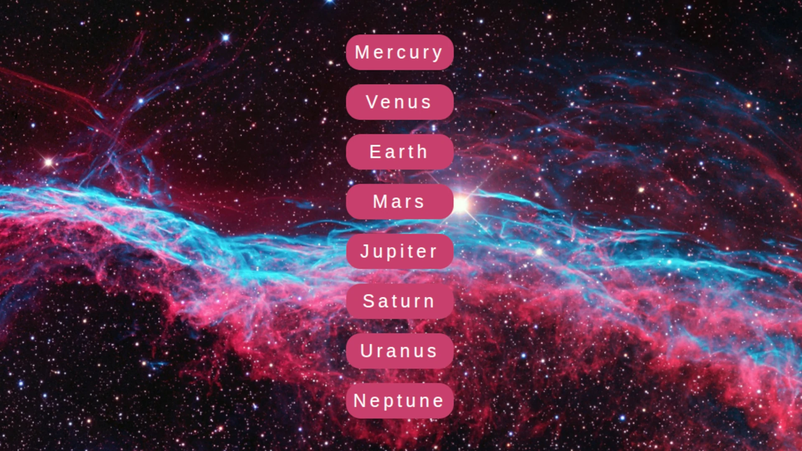

# 🚀 Space Navbar

A space-themed responsive navigation bar created using **HTML** and **CSS**.  
Perfect for practice or as a component in a sci-fi styled website.

> 🧠 This project is a **practical implementation** of a tutorial by [Abdelrahman Gamal](https://www.youtube.com/@AbdelrahmanGamal).
https://www.youtube.com/watch?v=429mEJF_VEg&t=22s&pp=ygUYY3JlYXRpdmUgbmF2YmFyIGh0bWwgY3Nz

## 🌟 Features

- Responsive design
- Planet icons with hover effects
- Smooth layout with Flexbox
- Custom colors and space theme

## 📸 Preview

## 🛠️ Technologies Used

- HTML5
- CSS3 (Flexbox, pseudo-elements)

## 📁 Folder Structure

